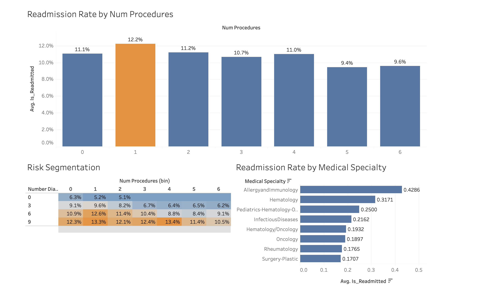

# Hospital-30-day-Readmission-Analysis (1999-2008)

Analyzing the readmission rate with 30 days in Diabetes 130-US Hospitals for years 1999-2008. Interactive Tableau dashboard can be found [here](https://public.tableau.com/app/profile/noravel/viz/ReadmissionRatebyNumProcedures/ReadmissionProject)

## North Star Metric and Dimensions
- North Star Metric: 30-Day Readmission Rate (10.7% baseline)
- Dimensions:
  - Number of Procedures (0-6)
  - Number of Diagnoses (0-9+)
  - Medical Specialty
  - Time in Hospital (1-14 days)
  - Number of Medications (1-100)
    
## Summary of Insights
### The 1 Procedure Paradox
- Patients with exactly **1 procedure** show a **12.2% readmission rate** - the highest across all procedure count groups
- This is **21.6% higher** than the overall baseline of 10.7%
- In contrast, patients with **5+ procedures** have **lower** readmission rates (< 10%)

### Diagnosis Complexity Drives Risk
- Higher number of diagnoses correlates with higher readmission risk

### High-Risk Patient Segments
- The combination of **1 procedure + 3+ diagnoses** creates identifiable high-risk segments

### Top 3 Medical Specialties with Highest Readmission Risk
1. **Allergy/Immunology**: 42.9% readmission rate
2. **Hematology**: 31.7% readmission rate
3. **Pediatrics-Hematology-Oncology**: 25.0% readmission rate

## Recommendation & Next Steps

### For Case Management Teams
- Priotize discharge planning for single procedure patients
- Target Allergy/Immunology and Hematology patients with enhanced post-discharge care
- Use procedure count + diagnosis count as quick screening criteria during discharge planning

### Further Analysis
- Calculate cost savings from preventing readmissions in identified high-risk segments
- Expand predictive model to improve risk prediction accuracy beyond 55%
   

